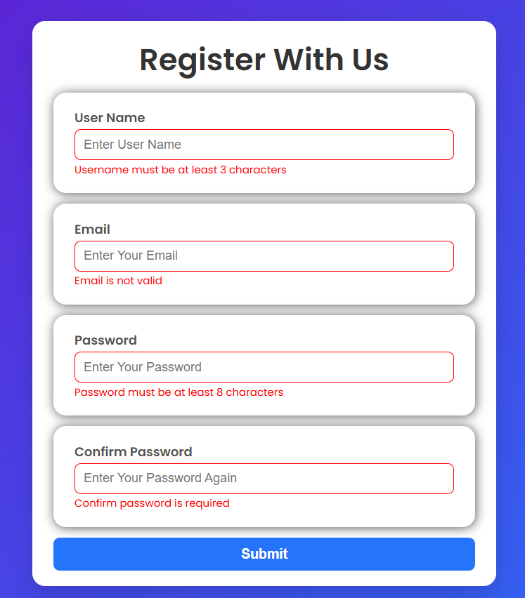
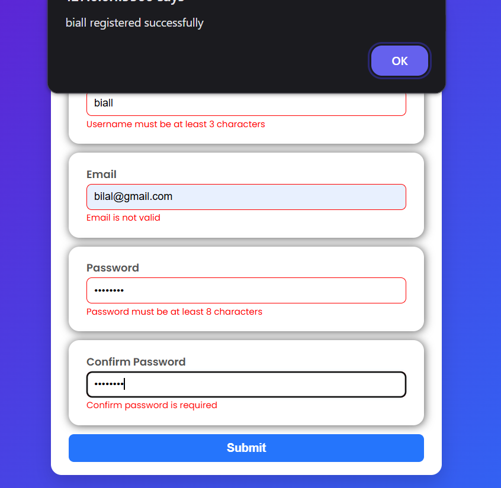

# 🚀 Form Validation App

A **responsive registration form** with modern JavaScript validation, styled with CSS.  
It checks required fields, length, email format, and password match — all with instant feedback!

---

## 🌟 Features

✅ User-friendly form validation  
✅ Error + success indicators  
✅ Validates:

- **Username** (min 3, max 15 characters)
- **Email format**
- **Password** (min 8, max 20 characters)
- **Confirm password** (must match password)  
  ✅ Responsive design  
  ✅ Clean, modern UI with CSS

---

## 📸 Demo





## 🛠️ Tech Stack

- HTML5
- CSS3
- JavaScript (Vanilla)

---

## 💡 How to Use

1️⃣ Clone the repository:

```bash
git clone https://github.com/iamsyedbilal/form-validation-js.git
```
